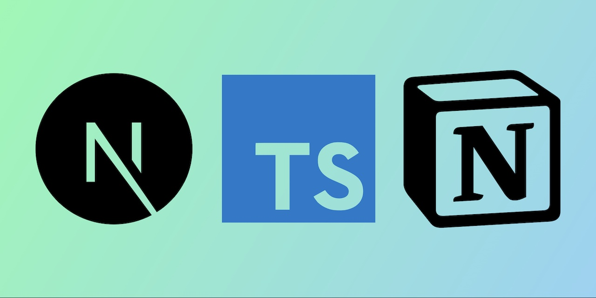

  

# Portfolio

 

> ## Intro

This is my personal [website site](https://juancruzllorens.dev/) built with Notion as a CMS, react-notion-x, Next.js, and Vercel.

> ## Setup

This project requires a recent version of Node.js (recommended >= 18).

1. Change [site.config.ts](./site.config.ts) with your Notion page id.
2. `npm install`
3. `npm run dev` to test locally
4. `npm run deploy` to deploy to Vercel

> ## License

MIT © [Juan Llorens](https://juancruzllorens.dev)
